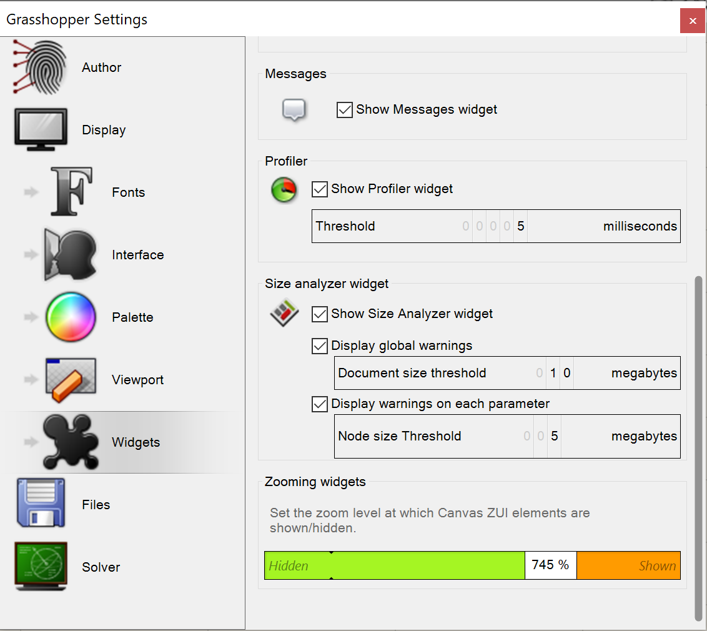
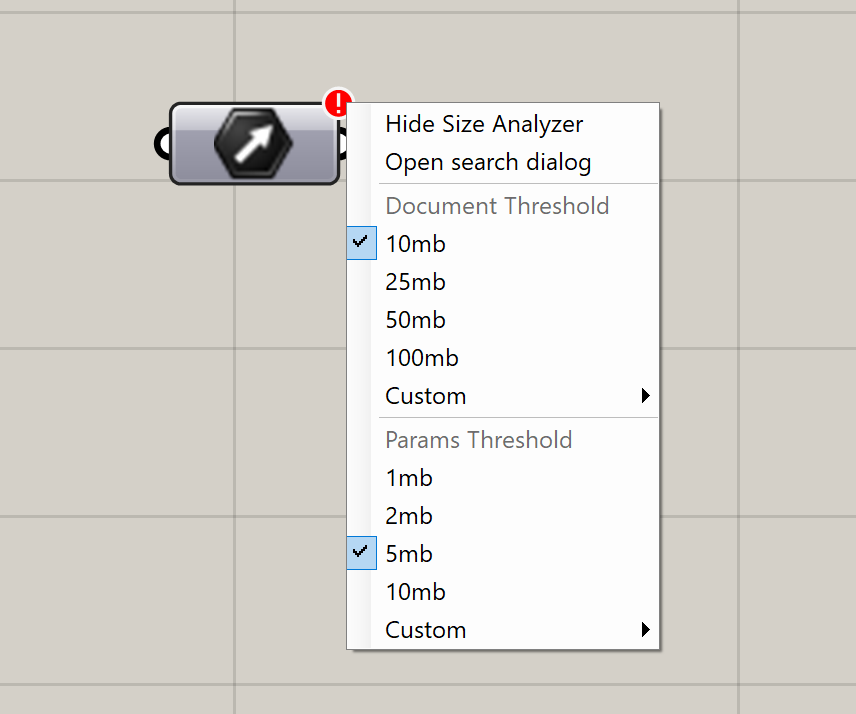

# Settings

`GH_SizeAnalyzer` has several configurable options that are exposed in two ways: the settings panel and via context menu

## Settings panel

The widget's settings can be found under `Settings -> Widgets`

### Show Size Analyzer

This checkbox will enable/disable the entire widget, preventing it from performing size operations and displaying results to the user.

### Global threshold

Allows for enabling/disabling the size warning for the entire document.

It also provides a number spinner to configure the threshold size to display the warning when enabled.

### Parameter threshold

Allows for enabling/disabling the size warning for each parameter..

It also provides a number spinner to configure the threshold size to display the warning when enabled.

## Context menu options

Both the global and parameter thresholds can be modified by right-clicking either the bottom-left warning panel, or the parameter warnings that appear at the top-right of each node.
