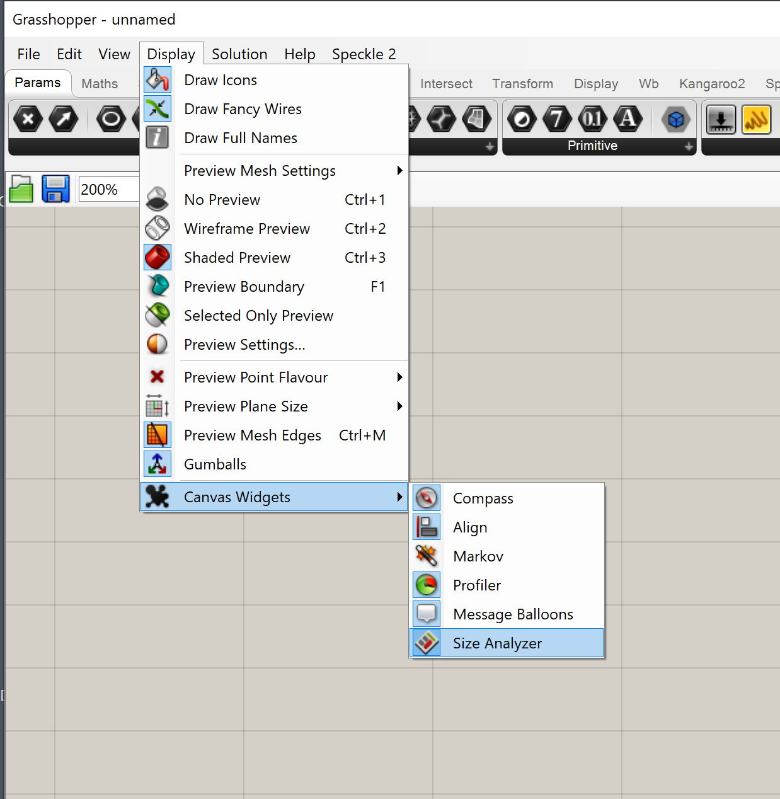
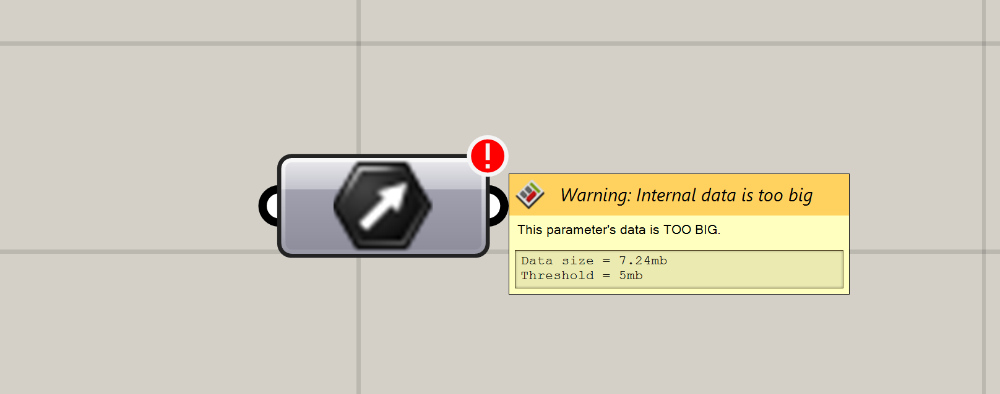
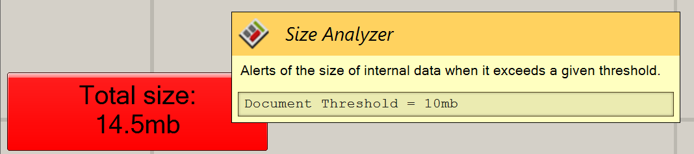
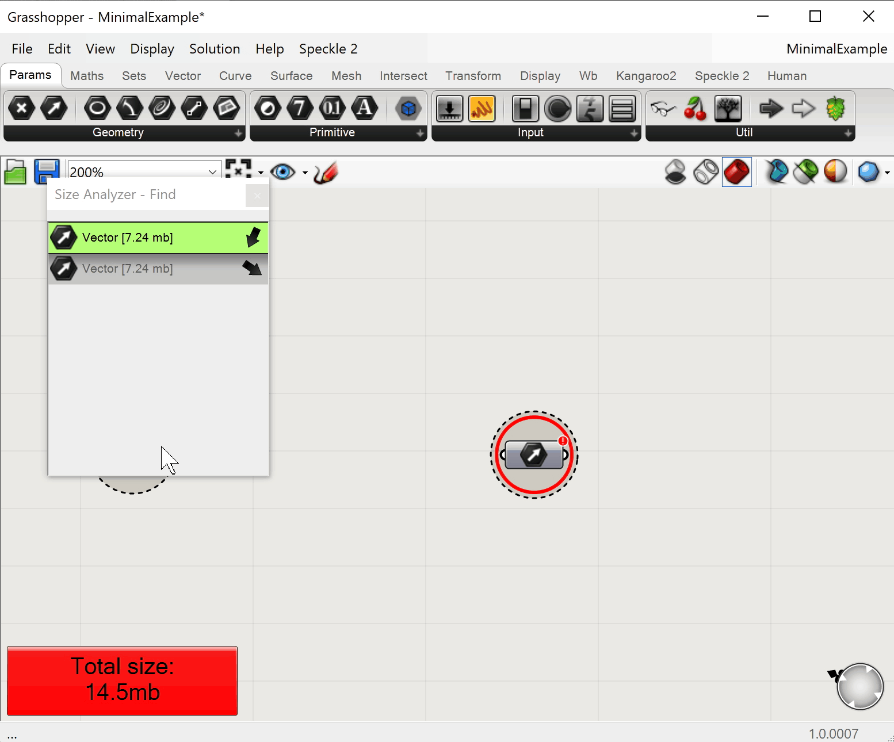

# Usage

## Getting started

Once installed, you can verify the plugin was loaded correctly by checking for the widget in:

`Display -> Widgets -> Size Analyzer`

There will be no other indication of the widget other than this, as we tried to make it as unobtrusive to the user as possible.

## Features

The widget will display one of 2 warnings when the internal data exceeds the threshold.

### Parameter size warning

This warning will be displayed on the top-corner of each parameter that has a bigger size than the threshold.

When hovered, it will display a tooltip explaining what it is, as well as the current size of that parameter and the configured threshold.

The threshold can be modified by right-clicking the warning.

## Document size warning

This warning will be displayed on the bottom-left corner of the Grasshopper canvas.

When hovered, it will display a tooltip explaining what it is, as well as the current threshold set for the document.

Just as with the _parameter warning_, right-clicking will display a context menu that will allow the user to edit the thresholds.

## Search

The search panel is currently only accessible via the context-menu of each warning, by clicking `Open search dialog`

This command will open a new pop-up window that will display a list of all parameters that currently exceed the specified threshold, isolating them from the rest of the components in the document.

It will display the size of each parameter as well as it's type, and when clicked the canvas will be focused on the specific parameter, as well as highlighted in red to better distinguish them in "busy" areas of the document.
