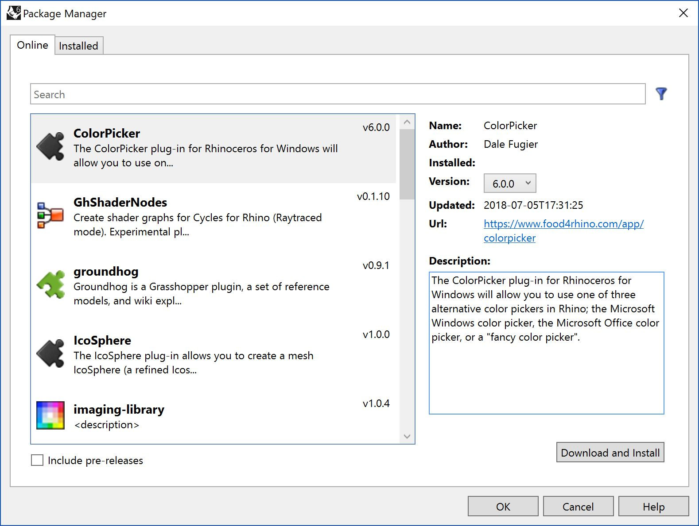
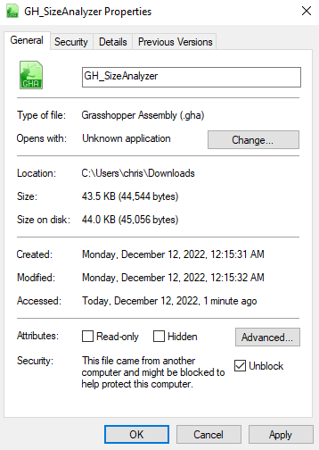

# Installing

::: tip :bulb: Note:
The version of this plugin is compatible with Rhino `version 7.13` or later (Recommended)
:::
There are two different ways to install the plugin. With Rhino 7 the packager manager makes it easier to install plugins from the server. However the old traditional way is always a valid option :smile:

---

### Install through the _Package Manager_ (Recommended)

::: tip :bulb: TIP:
The package manager requires a valid Rhino license and an internet connection
:::

1. To access the package manager go to the Rhino command line and type PackageManager.

2. You can place **gbs** into the search bar to search for `GH_SizeAnalyzer` plug-in. A tick next to the item in the search result will notify you which version you have installed and if there is a more recent version that can be downloaded.
   TODO: insert a screenshot with the search of our plugin
   

3. Click Install to install the selected version of the plug-in.

4. Restart Rhino to ensure the installation has taken effect.

---

### Install by Copy/Paste `.gha` file into the _Components Folder_

You can find the installer in this [link](https://github.com/Paramdigma/GH_SizeAnalyzer/releases/). Once downloaded, to install it properly, simply copy and paste the required file into the _Components Folder_. You can find this folder, by clicking on `File` > `Special Folders` > `Components Folder` or navigate in the file explorer to this directory `C:\Users\user\AppData\Roaming\Grasshopper\Libraries`

::: tip :bulb: TIP:
Before running Rhino, since the component is distributed from another computer and downloaded from the internet, the operating system might block it to secure your computer. In this case the component will not be loaded by grasshopper. In order to unblock it, `Right-click` > `Properties` on the `GH_SizeAnalyzer.gha` file itself and check the unblock box.
:::

### Uninstalling

This is the uninstallation content
