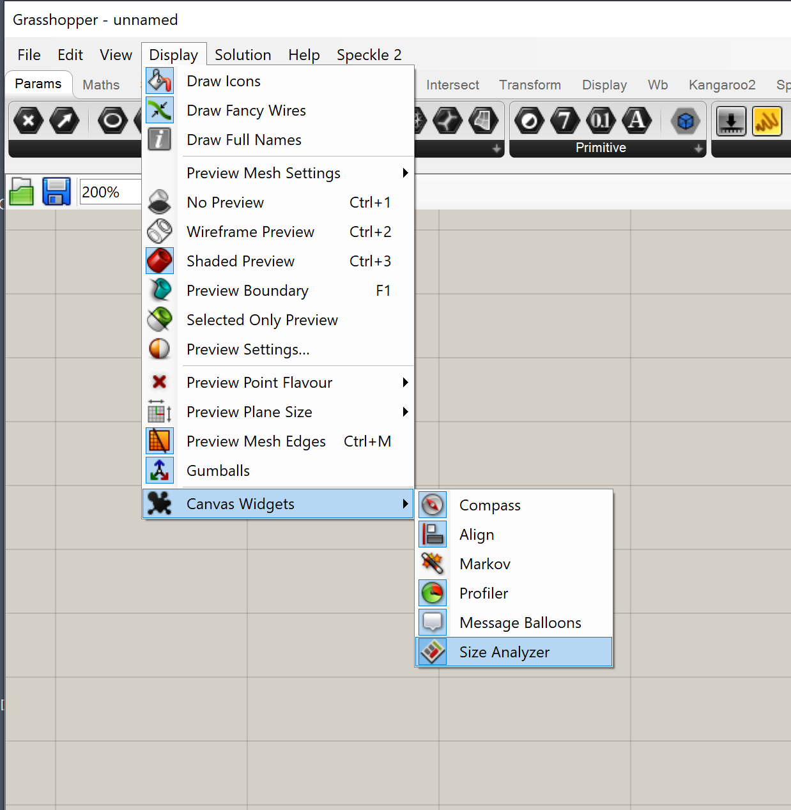
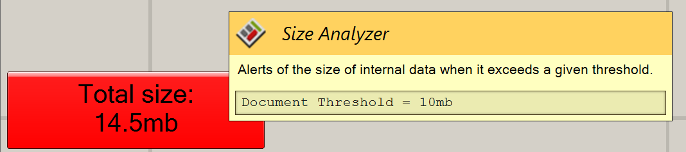
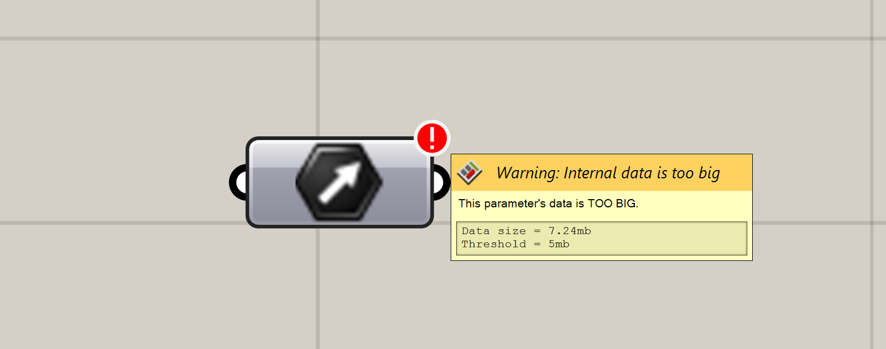
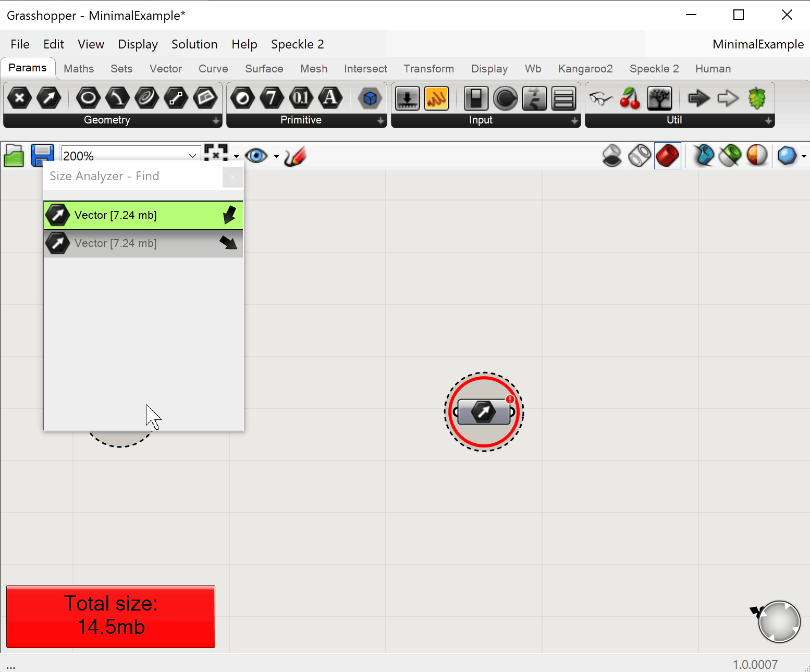

# Introduction

`GH_SizeAnalyzer` aims to provide a quick way to find the Grasshopper nodes that have **too much data** internalized.

## What problem does it try to solve?

There are 2 Grasshopper features that tend to clash with each other when used incorrectly.

- The ability to internalize data inside any parameter
- The ability to auto-save the document whenever anything changes.

Under normal circumstances, these 2 features work as expected. The problem comes when a user starts to internalize **too much data** inside different Grasshopper parameters within a document.

As a Grasshopper document grows, the internalized data can start **slowing down** the auto-save process, as it needs to save all that internal data too! This appears to the user as a delay between any change of component wires, which freezes Grasshopper for a perceptible amount of time.

The problem becomes even more frustrating because by the time you realize this, you may have dozens of nodes that need manual checking to identify which ones have to be slimmed down.

::: tip :bulb:
This is not a flaw on McNeel's side, it was just never designed to store a lot of data within the Grasshopper document.:::

## Previous solutions

### De-activate auto-save

A quick search on McNeel's forum returns several user's bumping into this throughout the years, with the overall recommendation being to **deactivate auto-save**.

https://discourse.mcneel.com/search?q=grasshopper%20autosave%20slow

This recommendation is a recipe for disaster, as surely some work will be lost at some point of that document's history due to the fact that auto-save was disabled in pro of usability.

### Reference data instead of internalizing

You can prevent the auto-save from slowing down if instead the data is stored in an outside source, which can be a Rhino document, or a plain old text file. Rhino is much better at storing data in an `rhp` file than Grasshopper is at doing the same in a `gh` file.

Once the data is no longer stored in Grasshopper, you can reference back either by using `referenced objects`, a `grasshpper pipeline` or even `data input/output` nodes.

::: tip :bulb: TIP:
This would be our recommended approach, and the reason this widget exists 🙂
:::

## How does `GH_SizeAnalyzer` help?

`GH_SizeAnalyzer` is a Grasshopper plugin that provides a new **widget** under the `Widgets` section.

### Features

The widget will draw 2 new warnings in the Grasshopper canvas:

#### Document size warning

A red capsule that is drawn on the bottom-left corner of the Grasshopper canvas whenever the total size of internal data in a given document exceeds a specific user-defined threshold.

#### Parameter size warning

A small red badge that is drawn on the top-right corner of any given parameter (or component input) whose internal data size exceeds a specific user-defined threshold.

#### Parameter search

Similar to Grasshopper's `F3` Search panel. This search panel allows the user to focus on the parameters that have the largest size quickly, and to further highlight any parameters that exceed the size threshold so they can be easily found.

